# Not only Lift-and-Shift for Java web application
>Author: [Dariusz Porowski](http://DariuszPorowski.MS/about/)
>
>Date: 2018-02-26

This article describes how we run Java Spring Boot web application on Microsoft Azure cloud, what was initially designed to run into an on-premises environment, and how we leverage Platform as a Service (PaaS) services to reduce infrastructure management overhead and increase scalability and reliability.

## Table of Contents
* [Executive summary](#executive-summary)
* [Customer profile](#customer-profile)
* [Key technologies used](#key-technologies-used)
* [Core team](#core-team)
* [Problem statement](#problem-statement)
* [Solution, steps, and delivery](#solution-steps-and-delivery)
	* [Architecture](#architecture)
	* [App Service on Linux](#app-service-on-linux)
	* [Azure SQL Database](#azure-sql-database)
	* [Azure Blob Storage](#azure-blob-storage)
	* [Azure Functions & Event Grid](#azure-functions--event-grid)
	* [DevOps](#devops)
* [Future work](#future-work)
	* [Allowing users to log in with their corporate credentials by enabling single sign-on (SSO)](#allowing-users-to-log-in-with-their-corporate-credentials-by-enabling-single-sign-on-sso)
	* [Increase security and control over keys and passwords](#increase-security-and-control-over-keys-and-passwords)
	* [Connect search results to business goals with full-text search on files](#connect-search-results-to-business-goals-with-full-text-search-on-files)
	* [Keep user session data in scalable application](#keep-user-session-data-in-scalable-application)
	* [Increase network security connections](#increase-network-security-connections)
* [Conclusion](#conclusion)
	* [Polkomtel - in their own words](#polkomtel-in-their-own-words)

## Executive summary
Together with developers form the Internet and Corporate Systems department in Polkomtel, we have built a Proof of Concept (PoC) solution for Corporate Portal (mainly for HR and PR departments) written in Java Spring Boot framework. Common goals for both sides ware run Web App using PaaS services as possible and learn as much as possible about modern application development and deployment patterns, cloud services, and Microsoft Azure cloud itself.

## Customer profile
[Polkomtel](http://www.polkomtel.pl/) is part of [Grupa Cyfrowy Polsat](http://www.grupapolsat.pl/), one of the largest Polish companies and a leading media and telecommunications group in the region. Polkomtel is the operator of [Plus](http://www.plus.pl/) mobile network which was launched in 1996 and currently has around 13,5 million users.


Since the beginning of its operations, Polkomtel has been the pioneer in introducing latest technological solutions to the Polish market. It has been dynamically implementing data transmission technologies which enable increasingly faster access to the Internet. As much as 99% of Poland’s population has access to the Internet which can be conveniently used not only in the biggest cities but also in less urbanized areas.

The product portfolio of Polkomtel, apart from offering the standard voice services, also includes numerous data transmission-dedicated services, information, entertainment and location-based services, mobile payments as well as numerous other modern solutions which are useful for both business users and residential customers. 

## Key technologies used
During hackfest we used the following technologies and services:
* [Azure Web App for Containers](https://azure.microsoft.com/en-us/services/app-service/containers/) - Easily deploy and run containerized web apps that scale with your business.
* [Azure SQL Database](https://azure.microsoft.com/en-us/services/sql-database/) - Managed relational SQL Database as a service.
* [Azure Blob Storage](https://azure.microsoft.com/en-us/services/storage/blobs/) - REST-based object storage for unstructured data.
* [Azure Functions](https://azure.microsoft.com/en-us/services/functions/) - Process events with Serverless code.
* [Azure Event Grid](https://azure.microsoft.com/en-us/services/event-grid/) - Get reliable event delivery at massive scale.
* [Azure Application Insights](https://azure.microsoft.com/en-us/services/application-insights/) - Detect, triage, and diagnose issues in your web apps and services.
* [Azure Container Registry](https://azure.microsoft.com/en-us/services/container-registry/) - Store and manage container images across all types of deployments.
* [Visual Studio Team Services](https://azure.microsoft.com/en-us/services/visual-studio-team-services/) - Services for teams to share code, track work, and ship software.
* [Azure Resource Manager](https://azure.microsoft.com/en-us/features/resource-manager/) - Simplify how you manage your app resources.

## Core team
The project team consisted of the following members:
* [Dariusz Porowski](http://DariuszPorowski.MS) - Microsoft - Senior Technical Evangelist
* Łukasz Grzegorczyk - Microsoft - Program Manager
* Łukasz Cabaj - Polkomtel - Internet and Corporate Systems Team Manager
* Daniel Pawłowski - Polkomtel - Software Developer (Java)
* Michał Flis - Polkomtel - Junior Software Developer (Java)
* Łukasz Michałowski - Polkomtel - Frontend Developer
* Mateusz Prędki - Polkomtel - DevOps Engineer

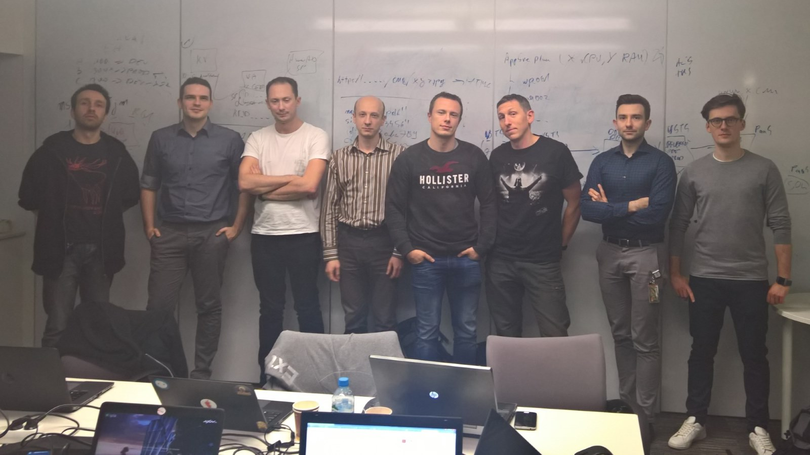
*Figure 1. Hackfest members*

## Problem statement
Developers from Polkomtel have the only experience in developing Java application in on-premises infrastructure. They have not touched any cloud before, they want to try Microsoft Azure cloud with their new project, but we what to do it in the right way to take advantages of cloud capabilities. They have lacked in knowing how to architecture app on the cloud to achieve a couple of goals like:
* Scalability and reliability 
* Overall performance
* Easier maintenance 
* DevOps cycle

Based on this PoC experience they want to have a comparison to the on-premises development and know to recommend a right direction for future Cloud projects. One of the main PoC assumptions was to use as much as possible Platform as a Service (PaaS), instead of classic infrastructure include Infrastructure as a Service (IaaS).

## Solution, steps, and delivery
Based on Polkomtel's needs, technology stack, and knowledge, we have decided to use App Service on Linux with Docker containers, Azure SQL Database, Azure Storage Blob, Azure Functions, Azure Application Insights, Visual Studio Team Services. This section describes the steps that have been realized during hackfest.

### Architecture
We started with a discussion about architecture. The Polkomtel team tried to describe how their solution works, what components are used for the platform, and how everything is connected.

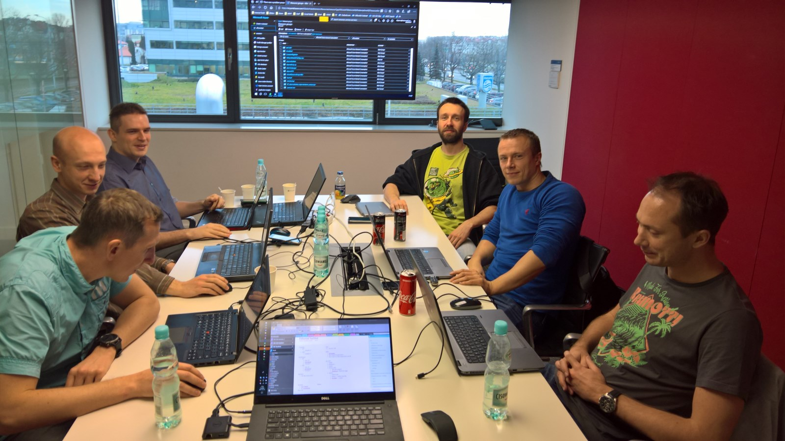

*Figure 2. Architecture Design Session*

At a high level, the entire solution is split into two web applications: Portal for end-user public access, and CMS for Polkomtel's employees.

After whiteboard and brainstorm session we agreed on the following PoC architecture:

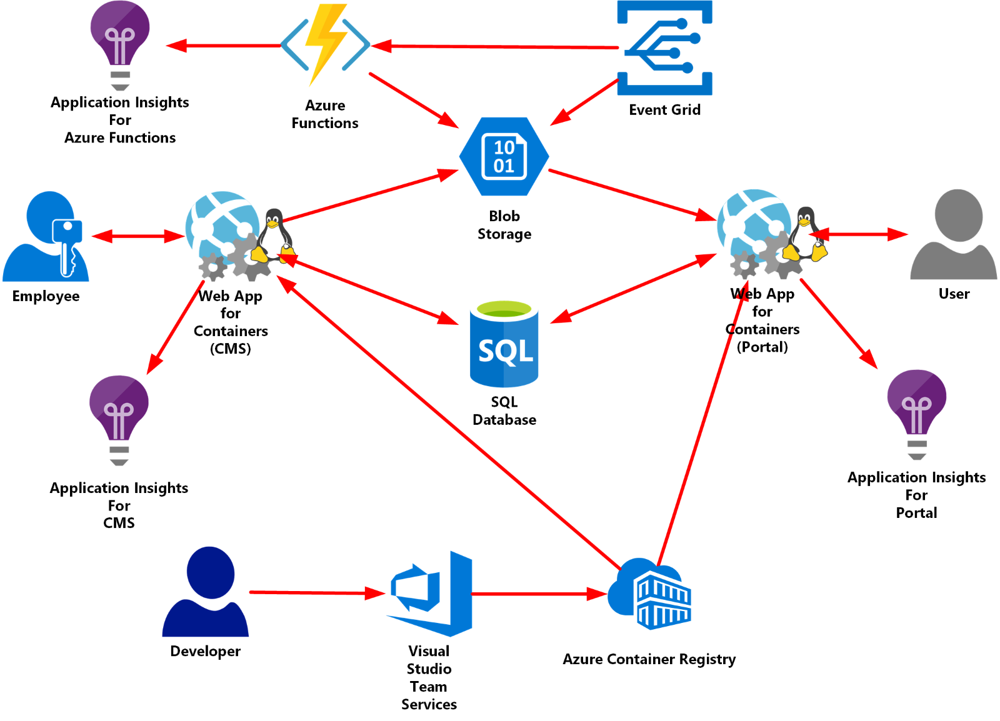

*Figure 3. PoC Architecture on Azure*

### App Service on Linux
Both applications have written in Java Spring Boot and running on Tomcat server. To host applications, we decided to use Web App for Containers. The primary goal of this task was to create Docker container image.

In the first iteration, we have created [Dockerfile](https://docs.docker.com/engine/reference/builder/) using [tomcat:8.5](https://hub.docker.com/_/tomcat/) as the base image. Everything worked good, but we realized the image size is quite large. So, we decided to optimize it and use an image based on the popular [Alpine Linux](http://alpinelinux.org/) project, available in the official [alpine image](https://hub.docker.com/_/alpine). Alpine Linux is much smaller than most distribution base images (~5MB), and thus leads to much slimmer images in general.

The final version of our Deckerfile with **tomcat:8.5-alpine** base image looks like below:

```dockerfile
FROM tomcat:8.5-alpine
LABEL maintainer="Dariusz.Porowski@microsoft.com"
COPY ./start_services.sh /bin/
RUN apk add --no-cache --update openssh-server \
    && echo "root:Docker!" | chpasswd \
    && apk update \
    && apk add --no-cache openrc \
    && rc-status \
    && touch /run/openrc/softlevel \
    && rm -rf /var/cache/apk/* /tmp/* \
    && rm -rf /usr/local/tomcat/conf/server.xml \
    && rm -rf /usr/local/tomcat/webapps/ \
    && chmod 755 /bin/start_services.sh
COPY ./sshd_config /etc/ssh/
COPY ./server.xml /usr/local/tomcat/conf/server.xml
COPY ./target/cms.war /usr/local/tomcat/webapps/ROOT.war
EXPOSE 8080 2222
ENTRYPOINT ["/bin/start_services.sh"]
```

Above example use two external files for configuration what we focus on in this article. First is **start\_services.sh** which is an entry point for Docker container and run SSH daemon and Tomcat server.

```bash
#!/bin/bash

# Starting SSH
rc-service sshd start

# Starting Tomcat
/usr/local/tomcat/bin/catalina.sh run
```

The second external file is **sshd_config** - it is the OpenSSH server configuration file. The content of the file is below.

```bash
#
# /etc/ssh/sshd_config
#

Port    2222
ListenAddress   0.0.0.0
LoginGraceTime  180
X11Forwarding   yes
Ciphers aes128-cbc,3des-cbc,aes256-cbc
MACs    hmac-sha1,hmac-sha1-96
StrictModes yes
SyslogFacility  DAEMON
PasswordAuthentication	yes
PermitEmptyPasswords	no
PermitRootLogin yes
```

SSH communication support is not required for running application itself, but it is very useful for troubleshooting or administrative tasks. 

To enable SSH support for Web App for Container couple of things needed to be done:
* Password for the **root** account must be: **Docker!**
* The **sshd_config** file must include the following or the connection fails:
    * Ciphers must include at least one of the following: **aes128-cbc,3des-cbc,aes256-cbc**.
    * MACs must include at least one of the following: **hmac-sha1,hmac-sha1-96**.
    * Port must set to **2222**.
    * PermitRootLogin must set to **Yes**.

* Include port **2222** in the [EXPOSE](https://docs.docker.com/engine/reference/builder/#expose) instruction for the Dockerfile.

This configuration does not allow external connections to the container. SSH can only be accessed via the [KUDU / SCM](https://github.com/projectkudu/kudu/wiki/Accessing-the-kudu-service) site, which is authenticated using the publishing credentials.

More information about SSH configuration you can find in  the documentation: [SSH support for Azure App Service on Linux](https://docs.microsoft.com/en-us/azure/app-service/containers/app-service-linux-ssh-support).

To speed up development and skip setup of the local development environment, you can take advantage of multi-stage build in Docker. Below is Dockerfile example with official Maven container image based on Alpine Linux as well.

```dockerfile
FROM maven:3.5-jdk-8-alpine AS build
COPY ./src /usr/src/app/src
COPY ./pom.xml /usr/src/app
RUN mvn -f /usr/src/app/pom.xml clean package

FROM tomcat:8.5-alpine AS final
LABEL maintainer="Dariusz.Porowski@microsoft.com"
COPY ./start_services.sh /bin/
RUN apk add --no-cache --update openssh-server \
    && echo "root:Docker!" | chpasswd \
    && apk update \
    && apk add --no-cache openrc \
    && rc-status \
    && touch /run/openrc/softlevel \
    && rm -rf /var/cache/apk/* /tmp/* \
    && rm -rf /usr/local/tomcat/webapps/ \
    && chmod 755 /bin/init_container.sh  
COPY ./sshd_config /etc/ssh/
COPY --from=build /usr/src/app/target/cms.war /usr/local/tomcat/webapps/ROOT.war
EXPOSE 8080 2222
ENTRYPOINT ["/bin/start_services.sh"]
```

More information about Multi-Stage builds in Docker you can find in the documentation: [Use multi-stage builds](https://docs.docker.com/develop/develop-images/multistage-build/).

To finalize Web App configuration, if application server uses other port than 80, make sure you have configured environment variable **WEBSITES_PORT** set application server port. In our case was **8080**.

> **Note**
>
> *server.xml* is custom Tomcat server configuration. It is not a part of this documentation.

All files used in this section you can find on the GitHub [here](https://github.com/DariuszPorowski/TechCaseStudies/tree/master/Polkomtel/src/Docker/).

To learn more how to prepare own Docker images for Web App for Containers to support Java applications go to:
* [Use a custom Docker image for Web App for Containers](https://docs.microsoft.com/en-us/azure/app-service/containers/tutorial-custom-docker-image)
* [Apache Tomcat on Azure App Service](https://github.com/Azure-App-Service/tomcat)

### Azure SQL Database
In the initial phase of the project, Polkomtel has chosen Microsoft SQL Server as database engine. Moved to Azure SQL Database was very easy. We did backup of on-premise database and restored it to Azure SQL Database.

In this step, we have decided to change JDBC driver from old jTDS project to [Microsoft JDBC Driver for SQL Server](https://docs.microsoft.com/en-us/sql/connect/jdbc/microsoft-jdbc-driver-for-sql-server) which is supported and continuously developed. The Microsoft JDBC Driver for SQL Server is a Type 4 JDBC driver that provides database connectivity with SQL Server through the standard JDBC APIs. 

The first thing we have done is declare a dependency in Maven POM file.

```xml
<dependency>
    <groupId>com.microsoft.sqlserver</groupId>
    <artifactId>mssql-jdbc</artifactId>
    <version>6.2.2.jre8</version>
</dependency>
```

Next step was to specify Connection String in **application.properties** file. Below part represents database configuration. 

```txt
spring.datasource.url=jdbc:sqlserver://********.database.windows.net:1433;database=********;encrypt=true;trustServerCertificate=false;hostNameInCertificate=*.database.windows.net;loginTimeout=30;
spring.datasource.username=********@********
spring.datasource.password=********
spring.datasource.driver-class-name=com.microsoft.sqlserver.jdbc.SQLServerDriver
spring.jpa.hibernate.dialect=org.hibernate.dialect.SQLServer2012Dialect
spring.jpa.hibernate.ddl-auto=validate
```

File-based configuration is suitable for quick local testing. In Containers world, standard practice is to generalize configuration and inject it dynamically through environment variables. We did it by setup right values on Web App for Containers application setting level.

* **SPRING_DATASOURCE_URL**=jdbc:sqlserver://\*\*\*\*\*\*\*\*.database.windows.net:1433;database=\*\*\*\*\*\*\*\*;encrypt=true;trustServerCertificate=false;hostNameInCertificate=*.database.windows.net;loginTimeout=30;
* **SPRING_DATASOURCE_USERNAME**=\*\*\*\*\*\*\*\*
* **SPRING_DATASOURCE_PASSWORD**=\*\*\*\*\*\*\*\*

To learn more about Java and SQL Server integration follow resources:
* [Microsoft JDBC Driver for SQL Server documentation](https://docs.microsoft.com/en-us/sql/connect/jdbc/microsoft-jdbc-driver-for-sql-server)
* [Microsoft JDBC Driver for SQL Server download](https://www.microsoft.com/en-us/download/details.aspx?id=55539)
* [Microsoft JDBC Driver for SQL Server source code](https://github.com/microsoft/mssql-jdbc)

### Azure Blob Storage
To build cloud application in the right way you need to have in mind couple of principals. One of them is to have stateless application. This applies to blob data as well as images, document files, etc.
The application has two different scenarios for blob data. During Hackfest we have created test implementation for Uploader and Downloader for both scenarios based on Azure Blob Storage service.

First scenario:
1. Employee creates new article or news and attaches images.
2. Images are stored on Blob Storage and are publicly available (blob only access mode).
3. Anonymous user read news or article, and attached images are loaded directly from Blob Storage.

Second scenario:
1. Anonymous user uploads CV through Web App.
2. CV is stored on Blob Storage without any external access (private access mode).
3. HR staff downloads CV through Web App.
4. Web App gets CV directly from Blob Storage using private access to the blob container.

The first thing we have done is declare a dependency in Maven POM file.
```xml
<dependency>
    <groupId>com.microsoft.azure</groupId>
    <artifactId>azure-storage</artifactId>
    <version>6.1.0</version>
</dependency>
```

Our implementation for **Uploader** and **Downloader** you can find on repository:
* controllers
    * [UploadController.java](https://github.com/DariuszPorowski/TechCaseStudies/tree/master/Polkomtel/src/Java/controllers/UploadController.java)
    * [DownloadController.java](https://github.com/DariuszPorowski/TechCaseStudies/tree/master/Polkomtel/src/Java/controllers/DownloadController.java)
* services
    * impl
        * [UploadServiceImpl.java](https://github.com/DariuszPorowski/TechCaseStudies/tree/master/Polkomtel/src/Java/services/impl/UploadServiceImpl.java)
        * [DownloadServiceImpl.java](https://github.com/DariuszPorowski/TechCaseStudies/tree/master/Polkomtel/src/Java/services/impl/DownloadServiceImpl.java)
    * [UploadService.java](https://github.com/DariuszPorowski/TechCaseStudies/tree/master/Polkomtel/src/Java/services/UploadService.java)
    * [DownloadService.java](https://github.com/DariuszPorowski/TechCaseStudies/tree/master/Polkomtel/src/Java/services/DownloadService.java)
* utils
    * [BlobHandler.java](https://github.com/DariuszPorowski/TechCaseStudies/tree/master/Polkomtel/src/Java/utils/BlobHandler.java)
    * [BlobData.java](https://github.com/DariuszPorowski/TechCaseStudies/tree/master/Polkomtel/src/Java/utils/BlobHandler.java)


To learn more about Java and Azure Storage integration follow resources:
* [Microsoft Azure Storage Library for Java](https://github.com/Azure/azure-storage-java) - This project provides a client library in Java that makes it easy to consume Microsoft Azure Storage services.
* [Microsoft Azure Storage Client SDK API](http://azure.github.io/azure-storage-java) - Documentation for Java SDK API.
* [Microsoft Azure Java Developer Center](https://azure.com/java) - Hub for every Java developer.
* [Azure for Java developers](https://docs.microsoft.com/en-us/java/azure/) - Get started developing Java apps for the cloud with these tutorials, tools, and libraries.

### Azure Functions & Event Grid
One of the requirements of the system was to create image thumbnails added to articles, news, etc. This part of the system has not yet been implemented yet in the Java application itself. We took this opportunity to implement the creation of thumbnails in the Serverless concept, through event-driven asynchronous processing. This approach makes the main application more lightweight.

So, we have built Serverless automatic thumbnail generation using Azure Event Grid and Azure Functions. Event Grid enables Azure Functions to respond to Azure Blob Storage events and generate thumbnails of uploaded images, or delete thumbnails if source image has been removed.

Flow is very simple:
1. An image is uploaded to a Blob Storage.
2. An event subscription is created against the Blob Storage create event.
3. A Function endpoint is called triggered by Event Grid.
4. Based on the condition, data passed to the function binding from Event Grid is used to:
    * access the source blob and generate the thumbnail image,
    * delete thumbnail image, if source image has been removed.

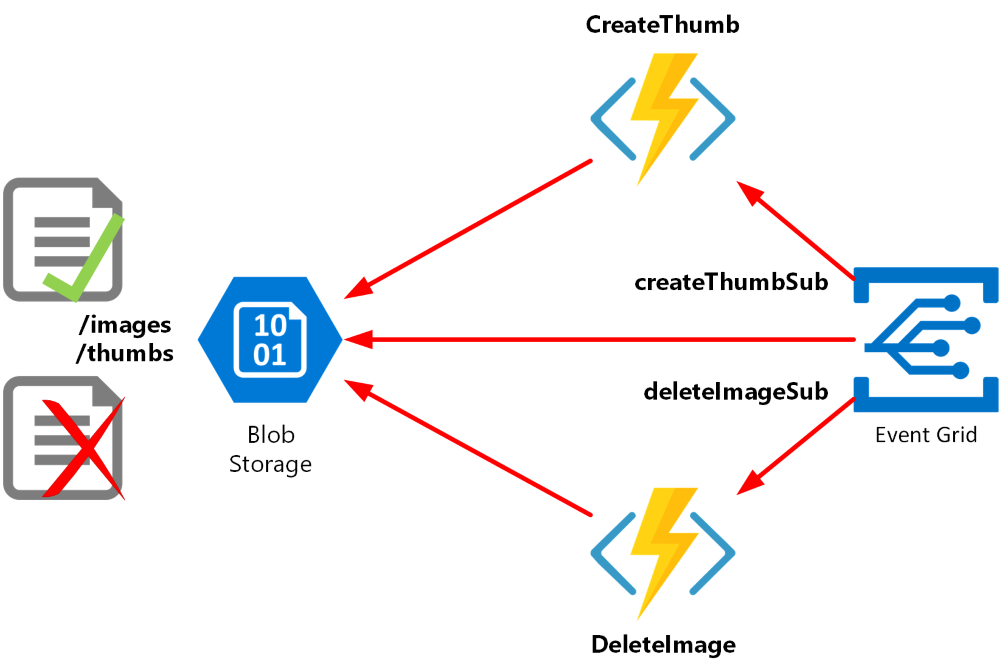

*Figure 4. Serverless architecture for image processing*

To prepare resources on the Azure side, we have developed a few scripts using [Azure CLI 2.0](https://azure.github.io/projects/clis/). In this case for the Bash shell. The first script deploys necessary infrastructure for integral Serverless components.

```bash
#!/bin/bash

# Variables
location=northeurope
rgName=plkplmspoc
storageAccountName=plkplmspoc
functionName=plkplmspoc

# Create a Resource Group
az group create --name $rgName --location $location

# Create a Storage Account
az storage account create --name $storageAccountName --resource-group $rgName --sku Standard_LRS --location northeurope --kind StorageV2 --access-tier Hot

# Create Blob Storage containers
storageAccountKey=$(az storage account keys list --resource-group $rgName --account-name $storageAccountName --query [0].value --output tsv)
az storage container create --name images --account-name $storageAccountName --account-key $storageAccountKey --public-access blob
az storage container create --name thumbs --account-name $storageAccountName --account-key $storageAccountKey --public-access blob

# Create a Function App
az functionapp create --name $functionName --storage-account $storageAccountName --resource-group $rgName --consumption-plan-location $location

# Configure the Function App
storageAccountConnectionString=$(az storage account show-connection-string --resource-group $rgName --name $storageAccountName --query connectionString --output tsv)
az functionapp config appsettings set --name $functionName --resource-group $rgName --settings STORAGE_ACCOUNT_CS=$storageAccountConnectionString THUMB_CONTAINER_NAME=thumbs IMAGE_CONTAINER_NAME=images THUMB_WIDTH=400 THUMB_HEIGHT=300
```

Script source code is available on the GitHub -  [azfuncdeploy01.sh](https://github.com/DariuszPorowski/TechCaseStudies/tree/master/Polkomtel/src/AzureFunctions/azfuncdeploy01.sh).

The next step was to deploy an Azure Function code. Two functions have been prepared. As a reference, we used [official documentation](https://docs.microsoft.com/en-us/azure/event-grid/resize-images-on-storage-blob-upload-event) and [example on GitHub](https://github.com/Azure-Samples/function-image-upload-resize).
* **CreateThumb** - to create thumbnail image after source image has been uploaded to Blob Storage.
* **DeleteImage** - to delete thumbnail image after source image has been removed form Blob Storage.

We have chosen pre-compiled C# approach to write Functions. Pre-compiled functions provide a better cold-start performance than C# script-based functions.

Source code for **CreateThumb** is following:

```csharp
using System;
using System.IO;
using Microsoft.Azure.WebJobs;
using Microsoft.Azure.WebJobs.Host;
using Microsoft.Azure.WebJobs.Extensions.EventGrid;
using ImageResizer;

namespace ImageProcessing
{
    public static class CreateThumb
    {
        [FunctionName("CreateThumb")]
        public static void Run([EventGridTrigger] EventGridEvent eventGridEvent, TraceWriter log)
        {
            var blobUri = new Uri((string)eventGridEvent.Data["url"]);

            var cloudBlob = StorageHelper.GetBlobReference(blobUri);
            string blobName = StorageHelper.GetBlobName(cloudBlob);

            var instructions = new Instructions
            {
                Width = GetThumbWidth(),
                Height = GetThumbHeight(),
                Mode = FitMode.Max,
                Scale = ScaleMode.DownscaleOnly
            };

            var outputBlob = StorageHelper.GetThumbnailBlobReference(blobName);

            using (MemoryStream inStream = new MemoryStream())
            {
                StorageHelper.RequestInputBlob(cloudBlob, inStream);
                inStream.Position = 0;

                using (MemoryStream outStream = new MemoryStream())
                {
                    try
                    {
                        ImageBuilder.Current.Build(new ImageJob(inStream, outStream, instructions));
                        outStream.Position = 0;
                        outputBlob.UploadFromStream(outStream);
                    }
                    catch (Exception e)
                    {
                        log.Info($"Exception caught at: {DateTime.UtcNow}, Message: {e.Message}");
                    }
                }
            }
        }

        private static int GetThumbWidth()
        {
            Int32 imageWidth;
            var imgWidth = Environment.GetEnvironmentVariable("THUMB_WIDTH");
            if (!Int32.TryParse(imgWidth, out imageWidth))
            {
                imageWidth = 400;
            }

            return imageWidth;
        }

        private static int GetThumbHeight()
        {
            Int32 imageHeight;
            var imgHeight = Environment.GetEnvironmentVariable("THUMB_HEIGHT");
            if (!Int32.TryParse(imgHeight, out imageHeight))
            {
                imageHeight = 300;
            }

            return imageHeight;
        }
    }
}

```

Source code for **DeleteImage** is following:

```csharp
using System;
using Microsoft.Azure.WebJobs;
using Microsoft.Azure.WebJobs.Extensions.EventGrid;
using Microsoft.Azure.WebJobs.Host;
using Microsoft.WindowsAzure.Storage.Blob;

namespace ImageProcessing
{
    public static class DeleteImage
    {
        [FunctionName("DeleteImage")]
        public static void Run([EventGridTrigger] EventGridEvent eventGridEvent, TraceWriter log)
        {
            var deletedBlobUri = new Uri((string)eventGridEvent.Data["url"]);
            var deletedImage = new CloudBlob(deletedBlobUri);

            var otherImage = deletedImage.Container.Name.Equals(StorageHelper.GetImageContainerName()) ?
                StorageHelper.GetThumbnailBlobReference(deletedImage.Name) :
                StorageHelper.GetImageBlobReference(deletedImage.Name);
            try
            {
                otherImage.DeleteIfExists();
            }
            catch (Exception e)
            {
                log.Info($"Exception caught at: {DateTime.UtcNow}, Message: {e.Message}");
            }
        }
    }
}
```

Full source code of our version include Helper classes you can find on [GitHub](https://github.com/DariuszPorowski/TechCaseStudies/tree/master/Polkomtel/src/AzureFunctions/ImageProcessing).

Before we could run the second script to finalize deployment, we had to fill in the correct Subscriber Endpoint addresses. You can find Endpoint on the [Azure Portal](https://portal.azure.com), in the details of the Function App. After selecting the function, select **Add Event Grid subscription**, and next correct Subscriber Endpoint URL will be shown in the panel. Copy and paste into the script, and do the same for the second function.

> **Note**
>
> You can automate this part as well to get the system key. Follow [this documentation](https://docs.microsoft.com/en-us/azure/azure-functions/functions-bindings-event-grid#get-the-system-key). We skipped this because it was not our goal for Proof of Concept.

```bash
#!/bin/bash

# Variables
rgName=plkplmspoc
storageAccountName=plkplmspoc
createThumbEndpoint="https://plkplmspoc.azurewebsites.net/admin/extensions/EventGridExtensionConfig?functionName=CreateThumb&code=SuperSecretCode"
deleteImageEndpoint="https://plkplmspoc.azurewebsites.net/admin/extensions/EventGridExtensionConfig?functionName=DeleteImage&code=SuperSecretCode"

# Create Event Grid event subscription to the Storage Account
storageAccountId=$(az storage account show --name $storageAccountName --resource-group $rgName --query id --output tsv)
az eventgrid event-subscription create --name createThumbSub --endpoint $createThumbEndpoint --resource-id $storageAccountId --endpoint-type webhook --included-event-types Microsoft.Storage.BlobCreated --subject-begins-with /blobServices/default/containers/images/blobs/
az eventgrid event-subscription create --name deleteImageSub --endpoint $deleteImageEndpoint --resource-id $storageAccountId --endpoint-type webhook --included-event-types Microsoft.Storage.BlobDeleted --subject-begins-with /blobServices/default/containers/images/blobs/
```

Script source code is available on the GitHub [azfuncdeploy02.sh](https://github.com/DariuszPorowski/TechCaseStudies/tree/master/Polkomtel/src/AzureFunctions/azfuncdeploy02.sh).

To learn more about Serverless on Azure follow that resources:
* [Serverless computing](https://azure.com/serverless) - take your mind off infrastructure and build apps faster.
* [Azure Functions](https://azure.microsoft.com/en-us/services/functions/) - build apps faster with a serverless architecture.
* [Event Grid](https://azure.microsoft.com/en-us/services/event-grid/) - get reliable event delivery at massive scale.
* [Logic Apps](https://azure.microsoft.com/en-us/services/logic-apps/) - quickly build powerful integration solutions.

### DevOps 
Developers in Polkomtel use quite a lot [DevOps](https://www.visualstudio.com/learn/what-is-devops/) tools in their on-premise environment like Subversion (SVN), Stash, JFrog Artifactory, Sonatype Nexus, Rundeck to create efficient DevOps tool-chain. During Architecture Design Session we agreed to try native Cloud approach as much as possible. Based on this we decided to try [Visual Studio Team Services (VSTS)](https://www.visualstudio.com/team-services/) for basic scenarios related to chosen services.

We have created a basic [Continuous Integration (CI)](https://www.visualstudio.com/learn/what-is-continuous-integration/) / [Continuous Delivery (CD)](https://www.visualstudio.com/learn/what-is-continuous-delivery/) pipeline for:
* Docker container used in App Service on Linux,
* Function Apps hosted on Azure Functions.

Our application uses Docker container, and to achieve full deployment pipeline for this scenario, we had to use Docker Registry. We have chosen [Azure Container Registry](https://azure.microsoft.com/en-us/services/container-registry/) (ACR) for it. ACR is Docker private registry, fully managed PaaS service.

> **Note**
>
> It is highly recommended using Service Principal for authentication to Azure Container Registry. To learn more, go to documentation: [Azure Container Registry authentication with service principals](https://docs.microsoft.com/en-us/azure/container-registry/container-registry-auth-service-principal).

Moreover, we have created [Infrastructure as Code (IaC)](https://www.visualstudio.com/learn/what-is-infrastructure-as-code/) template for Web Apps for Container, to have an easy way to create different environments like Test, QA, etc. in the future.

#### App Service on Linux
In this part, you find description of the basic CI/CD process for App Service on Linux what we have built.

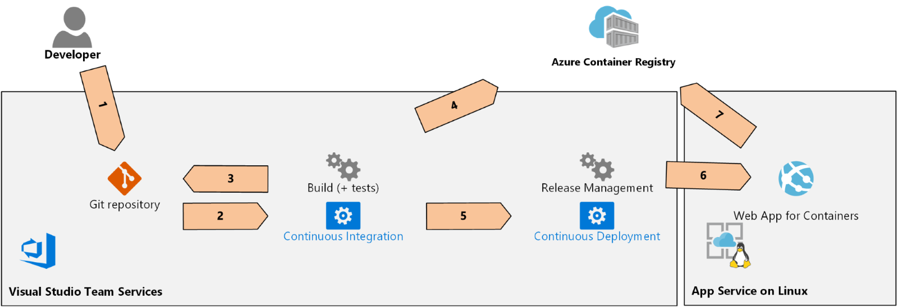

*Figure 5. VSTS pipeline for App Service on Linux*

Here is a brief explanation of the steps:

1. Developer commits code changes to Git repository.
2. Git repository triggers a CI.
3. Build gets the latest version of the source code and builds Java application with Maven, and next builds Docker container.
4. Build pushes an image to a Docker private registry created using the Azure Container Registry service.
5. Build triggers a CD.
6. Release Management triggers update process on Web App for Containers service.
7. Web App for Containers service pulls the latest version of the image.

Below are the detailed information and steps for the **Build** process.

* **Name:** plkpl-WebApp-cms-CI
* **Agent queue:** Hosted Linux
* **Triggers:**
    * Enabled continuous integration
    * Path filters:
        * (exclude) /
        * (include) /src/corporatePortal-cms

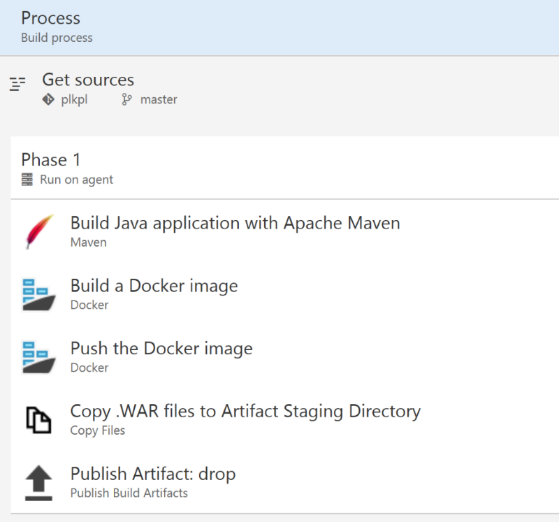

*Figure 6. Build in VSTS for App Service on Linux*

1. Build Java application with Apache Maven
* **Task:** Maven (1.*)
* **Maven POM file:** src/$(ProjectName)/pom.xml
* **Goal(s):** package

2. Build a Docker image
* **Task:** Docker (0.*)
* **Container Registry Type:** Azure Container Registry
* **Action:** Build an image
* **Docker File:** src/$(ProjectName)/Dockerfile
* **Image Name:** $(ImageName):$(Build.BuildId)
* **Qualify Image Name:** True

3. Push the Docker image
* **Task:**  Docker (0.*)
* **Container Registry Type:** Azure Container Registry
* **Action:** Push an image
* **Image Name:** $(ImageName):$(Build.BuildId)
* **Qualify Image Name:** True

4. Copy .WAR files to Artifact Staging Directory
* **Task:** Copy Files (2.*)
* **Source Folder:** $(Build.SourcesDirectory)
* **Contents:** **/*.war
* **Target Folder:** $(Build.ArtifactStagingDirectory)

5. Publish Artifact
* **Task:** Publish Build Artifacts (1.*)
* **Path to publish:** $(Build.ArtifactStagingDirectory)
* **Artifact name:** drop
* **Artifact publish location:** Visual Studio Team Services/TFS

Below are the detailed information and steps for the **Release** process:

* **Name:** plkpl-WebApp-cms-CD
* **Agent queue:** Hosted Linux
* **Triggers:**
    * Enabled continuous deployment

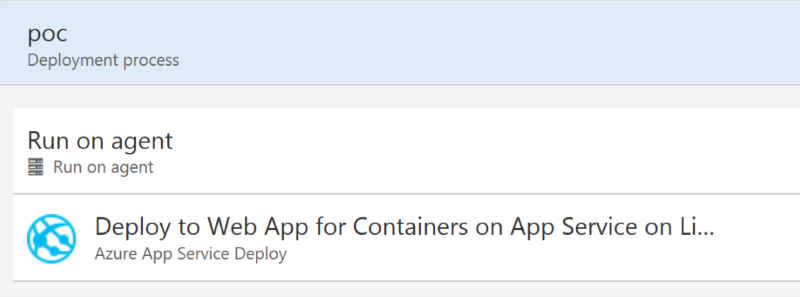

*Figure 7. Release in VSTS for App Service on Linux*

1. Deploy to Web App for Containers on App Service on Linux
* **Task:** Azure App Service Deploy (3.*)
* **App type:** Linux Web App
* **App Service name:** $(AppServiceName)
* **Image Source:** Container Registry
* **Registry or Namespace:** $(ContainerRegistry)
* **Image:** $(ImageName)
* **Tag:** $(Build.BuildId)
* **App settings:** -SPRING_DATASOURCE_URL $(SPRING_DATASOURCE_URL) -SPRING_DATASOURCE_USERNAME $(SPRING_DATASOURCE_USERNAME) -SPRING_DATASOURCE_PASSWORD $(SPRING_DATASOURCE_PASSWORD) -APPLICATION_INSIGHTS_IKEY $(APPLICATION_INSIGHTS_IKEY) -WEBSITES_PORT $(WEBSITES_PORT)

To learn more about topics in this section follow that resources:
* [App Service on Linux Documentation](https://docs.microsoft.com/en-us/azure/app-service/containers/) - Learn how to deploy, manage, and monitor secure web application on App Service on Linux.
* [Use a custom Docker image for Web App for Containers](https://docs.microsoft.com/en-us/azure/app-service/containers/tutorial-custom-docker-image) - Learn how to build a custom Docker image and deploy it to Web App for Containers.
* [Azure Container Registry Documentation](https://docs.microsoft.com/en-us/azure/container-registry/) - Learn how to use ACR - private Docker registry in Azure.
* [Best practices for Azure Container Registry](https://docs.microsoft.com/en-us/azure/container-registry/container-registry-best-practices) - By following these best practices, you can help maximize the performance and cost-effective use of your private Docker registry in Azure.
* [Visual Studio Team Services Documentation](https://docs.microsoft.com/en-us/vsts) - Learn how to build your own DevOps ecosystem.
* [Build and publish a container for your app](https://docs.microsoft.com/en-us/vsts/build-release/apps/containers/build) - Learn how to adapt a CI process to publish your Docker-enabled application from VSTS into the Azure Container Registry.
* [Build your Java app with Maven](https://docs.microsoft.com/en-us/vsts/build-release/apps/java/build-maven) - Learn how to adapt a CI process to Java application in VSTS.
* [Deploy to an Azure Web App for Containers](https://docs.microsoft.com/en-us/vsts/build-release/apps/cd/deploy-docker-webapp) - Learn how to set up Continuous Deployment of your Docker-enabled app to an Azure web app using VSTS.
* [VSTS for Java Documentation](https://java.visualstudio.com/docs) - To get you better acquainted with our Java tools and how they integrate into Visual Studio Team Service.
* [VSTS for Java Hands-On Labs](https://almvm.azurewebsites.net/labs/java/) - Labs give you a first-hand, technical experience on how you can leverage the Microsoft DevOps platform for Java development.

#### Azure Functions
In this part, you find description of the basic CI/CD process for Azure Functions what we have built.

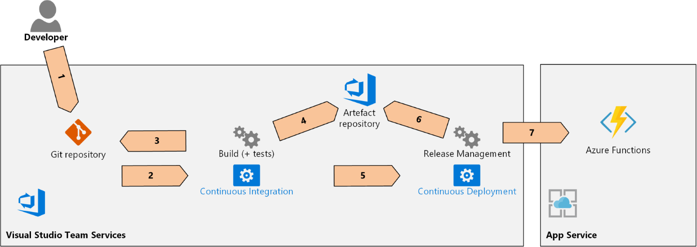

*Figure 8. VSTS pipeline for Azure Functions*

Here is a brief explanation of the steps:

1. Developer commits code changes to Git repository.
2. Git repository triggers a CI.
3. Build gets the latest version of the source code and builds a solution with Visual Studio Build.
4. Build pushes a compiled and prepared artifact to Artifact repository.
5. Build triggers a CD.
6. Release Management gets the latest version of the artifact from Artifact repository.
7. Release Management pushes the latest version to Azure Functions.

Below are the detailed information and steps for the **Build** process:

* **Name:** plkpl-AzFunc-CI
* **Agent queue:** Hosted VS2017
* **Triggers:**
    * Enabled continuous integration
    * Path filters:
        * (exclude) /
        * (include) src/AzureFunctions/ImageProcessing

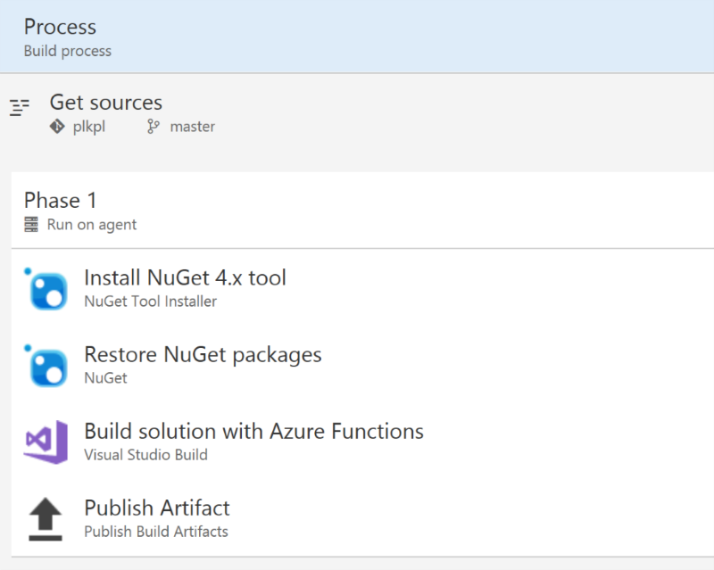

*Figure 9. Build in VSTS for Azure Functions*

1. Install NuGet 4.x tool
* **Task:** NuGet Tool Installer (0.*)
* **Version of NuGet.exe to install:** 4.x
* **Always download the latest matching version:** True

2. Restore NuGet packages
* **Task:** NuGet (2.*)
* **Command:** restore
* **Path to solution, packages.config, or project.json:** src/AzureFunctions/AzureFunctions.sln

3. Build solution with Azure Functions
* **Task:** Visual Studio Build (1.*)
* **Solution:** src/AzureFunctions/AzureFunctions.sln
* **Visual Studio Version:** Latest
* **MSBuild Arguments:** /p:DeployOnBuild=true /p:WebPublishMethod=Package /p:PackageAsSingleFile=true /p:SkipInvalidConfigurations=true /p:PackageLocation="$(Build.ArtifactStagingDirectory)\\"

4. Publish Artifact
* **Task:** Publish Build Artifacts (1.*)
* **Path to publish:** $(Build.ArtifactStagingDirectory)
* **Artifact name:** drop
* **Artifact publish location:** Visual Studio Team Services/TFS

Below are the detailed information and steps for the **Release** process:

* **Name:** plkpl-AzFunc-CD
* **Agent queue:** Hosted VS2017
* **Triggers:**
    * Enabled continuous deployment

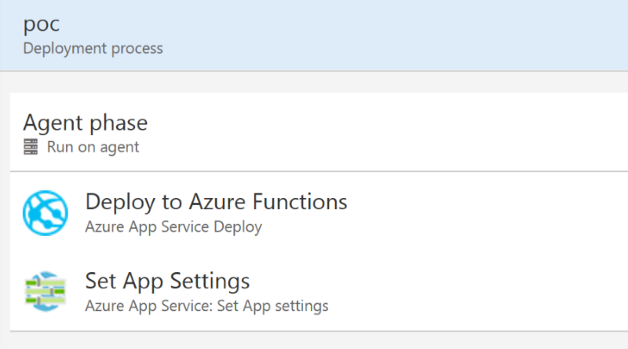

*Figure 10. Release in VSTS for Azure Functions*

1. Deploy to Azure Functions
* **Task:** Azure App Service Deploy (3.*)
* **App type:** Function App
* **App Service name:** $(AppServiceName)
* **Package or folder:** $(System.DefaultWorkingDirectory)/plkpl-AzFunc-CI/drop/AzureFunctions.zip

2. Set App Settings
* **Task:** Azure App Service: Set App settings (1.*)
* **Azure App Service:** $(AppServiceName)
* **Resource Group:** $(ResourceGroupName)
* **App Settings:**
    * AzureWebJobsDashboard='$(AzureWebJobsDashboard)'
    * AzureWebJobsStorage='$(AzureWebJobsStorage)'
    * FUNCTIONS_EXTENSION_VERSION='$(FUNCTIONS_EXTENSION_VERSION)'
    * WEBSITE_CONTENTAZUREFILECONNECTIONSTRING='$(WEBSITE_CONTENTAZUREFILECONNECTIONSTRING)'
    * WEBSITE_CONTENTSHARE='$(WEBSITE_CONTENTSHARE)'
    * WEBSITE_NODE_DEFAULT_VERSION='$(WEBSITE_NODE_DEFAULT_VERSION)'
    * APPINSIGHTS_INSTRUMENTATIONKEY='$(APPINSIGHTS_INSTRUMENTATIONKEY)'
    * STORAGE_ACCOUNT_CS='$(STORAGE_ACCOUNT_CS)'
    * THUMB_WIDTH='$(THUMB_WIDTH)'
    * THUMB_HEIGHT='$(THUMB_HEIGHT)'
    * THUMB_CONTAINER_NAME='$(THUMB_CONTAINER_NAME)'
    * IMAGE_CONTAINER_NAME='$(IMAGE_CONTAINER_NAME)'

To learn more about topics in this section follow that resources:
* [Continuous deployment for Azure Functions](https://docs.microsoft.com/en-us/azure/azure-functions/functions-continuous-deployment) - Learn how to adapt a CD process to Azure Functions.
* [Build and deploy to an Azure Web App](https://docs.microsoft.com/en-us/vsts/build-release/apps/cd/azure/aspnet-core-to-azure-webapp) - Learn how to configure an entire CI/CD pipeline for Azure App Service.
* [VSTS for Azure Functions Hands-On Labs](https://almvm.azurewebsites.net/labs/vstsextend/azurefunctions/) - Labs give you a first-hand, technical experience on how you can leverage the Microsoft DevOps platform for Azure Functions development.

#### Azure Resource Manager (ARM)
To speed up resource creation on hackfest to validate different conditions, we have created Azure Resource Manager (ARM) template for Web App for Containers. This template is a good reference for the future during production deployment to have a solution to create different environments like Test, QA, etc.

The most interesting part of ARM template in our case is App Settings for Web App. It is very important to have it if Web App has to use Docker Image form private Docker registry.

```json
{
            "apiVersion": "[variables('webAppApiVersion')]",
            "name": "[parameters('webAppName')]",
            "type": "Microsoft.Web/sites",
            "properties": {
                "name": "[parameters('webAppName')]",
                "serverFarmId": "[resourceId('Microsoft.Web/serverfarms', parameters('hostingPlanName'))]",
                "siteConfig": {
                    "appSettings": [
                        {
                            "name": "DOCKER_CUSTOM_IMAGE_NAME",
                            "value": "[parameters('dockerImageName')]"
                        },
                        {
                            "name": "DOCKER_REGISTRY_SERVER_URL",
                            "value": "[parameters('dockerRegistryUrl')]"
                        },
                        {
                            "name": "DOCKER_REGISTRY_SERVER_USERNAME",
                            "value": "[parameters('dockerRegistryUsername')]"
                        },
                        {
                            "name": "DOCKER_REGISTRY_SERVER_PASSWORD",
                            "value": "[parameters('dockerRegistryPassword')]"
                        },
                        {
                            "name": "WEBSITES_ENABLE_APP_SERVICE_STORAGE",
                            "value": "false"
                        }
                    ],
                    "linuxFxVersion": "[variables('dockerImageName')]",
                    "alwaysOn": true
                }
            },
            "location": "[parameters('location')]",
            "dependsOn": [
                "[concat('Microsoft.Web/serverfarms/', parameters('hostingPlanName'))]"
            ]
        }
```

The full source code of our ARM template in on the GitHub repository ([webAppForContainers.template.json](https://github.com/DariuszPorowski/TechCaseStudies/tree/master/Polkomtel/src/DevOps/webAppForContainers.template.json)), include parameters file ([webAppForContainers.parameters.json](https://github.com/DariuszPorowski/TechCaseStudies/tree/master/Polkomtel/src/DevOps/webAppForContainers.parameters.json)).

To learn more about ARM template follow that resources:
* [Azure Resource Manager Documentation](https://docs.microsoft.com/en-us/azure/azure-resource-manager/) - Learn how to use Resource Manager to deploy, monitor, and manage solution resources as a group.
* [Azure Quickstart Templates](https://azure.microsoft.com/en-us/resources/templates) - Deploy Azure resources through the Azure Resource Manager with community contributed templates to get more done. Deploy, learn, fork and contribute back.

## Future work
In addition to the above, we have discovered more needs. Unfortunately, the time of the hackfest did not allow us to cover all things. Below are recommendations and descriptions of scenarios as ideas for the further development of the application.

### Allowing users to log in with their corporate credentials by enabling single sign-on (SSO)
To achieve SSO with corporate credentials in a cloud-based web application, you can use, e.g., [OpenID Connect](http://openid.net/connect/) (OIDC) - is an authentication layer on top of [OAuth 2.0](https://oauth.net/2/) protocol. The easiest way is to use [Azure Active Directory](https://azure.microsoft.com/en-us/services/active-directory/) (AAD) as OIDC provider and integrate on-premise Active Directory with Azure Active Directory using [Azure AD Connect](https://docs.microsoft.com/en-us/azure/active-directory/connect/). The scenario is commonly known as [Hybrid Identity](https://docs.microsoft.com/en-us/azure/active-directory/active-directory-hybrid-identity-design-considerations-overview). Good documentation to start Proof Of Concept for Hybrid Identity is this document: [Azure Active Directory Proof Of Concept Playbook](https://gallery.technet.microsoft.com/aAzure-Active-Directory-acb19182).

How to implement that scenario in Java? Check this sample on GitHub for a Java app that uses Azure AD and the ADAL4J library for authenticating the user and calling a WebAPI using OAuth 2.0 access tokens: [Integrating Azure AD into a Java web application](https://github.com/Azure-Samples/active-directory-java-webapp-openidconnect).

### Increase security and control over keys and passwords
Almost every application use settings that are sensitive and must be protected, like: database connection strings, passwords, cryptographic keys, certificates, etc.  
One of a security best practice is you should never store that data in source control repository. It is a very easy way to leak - even if your source code system is private, e.g., on larger projects, you might want to restrict who can access the production secrets - different settings for development, test or production environments.

For this scenario, you can use [Azure Key Vault](https://azure.microsoft.com/en-us/services/key-vault/), which safeguards keys and secrets used by cloud apps and services. Developers can create own keys for development and testing in seconds, and then seamlessly migrate them to production keys. Security administrators can grant and revoke permission to keys, as needed.

Below you find two GitHub examples of Java applications and Azure Key Vault:
* [Getting started with Azure Key Vault in Java](https://github.com/Azure-Samples/key-vault-java-manage-key-vaults)
* [Java sample is showing authentication to Azure Key Vault using a certificate and ClientId and SecretId as well as signing with Key Vault](https://github.com/Azure-Samples/key-vault-java-certificate-authentication)

### Connect search results to business goals with full-text search on files
One of the functionality of Polkomtel's application is to help Human Resources (HR) department to collect CVs from candidates in files such as PDFs and Office documents. To increase user experience for search through CVs, you need to read their contents and index it.

The second scenario is search through images which has already added to the system to find the right one and use in the news or article. The image can be described using, e.g., tags manually and automatically through [Computer Vision API](https://azure.microsoft.com/en-us/services/cognitive-services/computer-vision/) part of [Cognitive Services](https://azure.microsoft.com/en-us/services/cognitive-services/) - Artificial Intelligence (AI) cloud services in Azure.

Both scenarios can use [Azure Blob Storage](https://azure.microsoft.com/en-us/services/storage/blobs/) (object storage service) as space for store blob data. For the second scenario, you can use [metadata](https://docs.microsoft.com/en-us/azure/storage/blobs/storage-properties-metadata) feature to store tags for images.

On top of Azure Blob Storage, you can put [Azure Search](https://azure.microsoft.com/en-us/services/search/) to index documents and metadata using [blob indexer](https://docs.microsoft.com/en-us/azure/search/search-howto-indexing-azure-blob-storage). The blob indexer can index storage metadata only, storage and content metadata, or both metadata and textual content.

Using Azure Search in this scenario you can ensure full-text search through document files and images metadata without querying SQL database, and this is a huge asset.

Below you will find three GitHub examples of Java applications and Azure Search:
* [Getting Started with Azure Search using Java](https://github.com/Azure-Samples/search-java-getting-started)
* [Getting started on managing Azure Search using Java](https://github.com/Azure-Samples/search-java-manage-search-service)
* [Java application that creates an Azure Search index and automatically populates it with data from a SQL Azure instance using indexers](https://github.com/Azure-Samples/search-java-indexer-demo)

### Keep user session data in scalable application
One of the challenges for high scalable application is keeping user session data. Why? Because for example, different requests may go to different nodes, servers may crash, or application is moving from server to server as necessary.
How to handle session data? A good solution to achieve it is [Azure Redis Cache](https://azure.microsoft.com/en-us/services/cache/).

Below you will find three GitHub examples of Java applications and Azure Redis Cache:
* [Getting started on managing Redis Cache using Java](https://github.com/Azure-Samples/redis-java-manage-cache)
* [Getting started on managing data connections for Web Apps using Java](https://github.com/Azure-Samples/app-service-java-manage-data-connections-for-web-apps)
* [Getting started on managing data connections for Web Apps on Linux using Java](https://github.com/Azure-Samples/app-service-java-manage-data-connections-for-web-apps-on-linux)

### Increase network security connections
The most important things for every IT project is security. After everything from the application point of view will be ready to run in the Cloud, next step is to publish it securely for public access. To do that, one of the good ideas is to use Web Application Firewall (WAF) - the feature of [Azure Application Gateway](https://azure.microsoft.com/en-us/services/application-gateway/) that provides centralized protection of your web applications from common web-based attacks, exploits, and vulnerabilities like SQL Injection, Cross-Site Scripting attacks, and session hijacks.

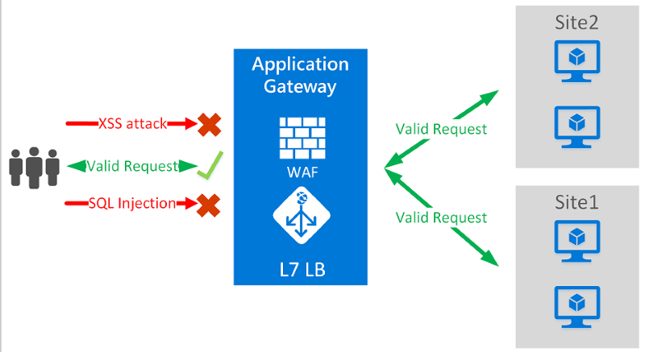

*Figure 11. Web Application Firewall*

As part of above approach, Docker container running into App Service on Linux should accept only connections form WAF. To achieve this, you can do IP address whitelisting based on Tomcat server configuration.

More information about Azure Application Gateway mad Web Application Firewall you can find on following links:
* [Azure Application Gateway Documentation](https://docs.microsoft.com/en-us/azure/application-gateway/) - Learn how to deploy Application Gateway, an application delivery controller (ADC) as a service.
* [Web Application Firewall Overview](https://docs.microsoft.com/en-us/azure/application-gateway/application-gateway-web-application-firewall-overview) - Learn more about WAF.

## Conclusion
In this document, we have described how to run Java application in Docker container using App Service on Linux, and moreover how to easily speed up software development process by implementing native Azure cloud services to the application what was not initially designed for the cloud.

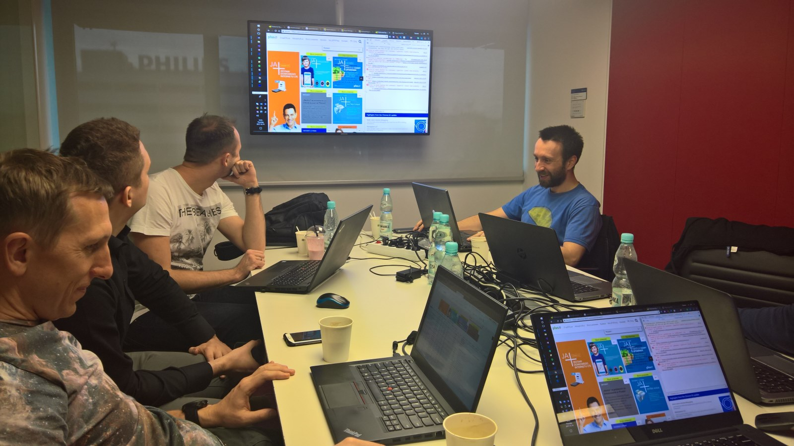

*Figure 12. Hack activities during Hackfest*

### Polkomtel - in their own words
> Highly responsive, with many ideas how to fit our existing project to Azure Cloud. You can be sure that your solution is scalable, optimized and secure as much as possible.
> I highly recommend hackfests with Dariusz, it is even better than regular training.
> 
>— Łukasz Cabaj - Internet and Corporate Systems Team Manager, Polkomtel
