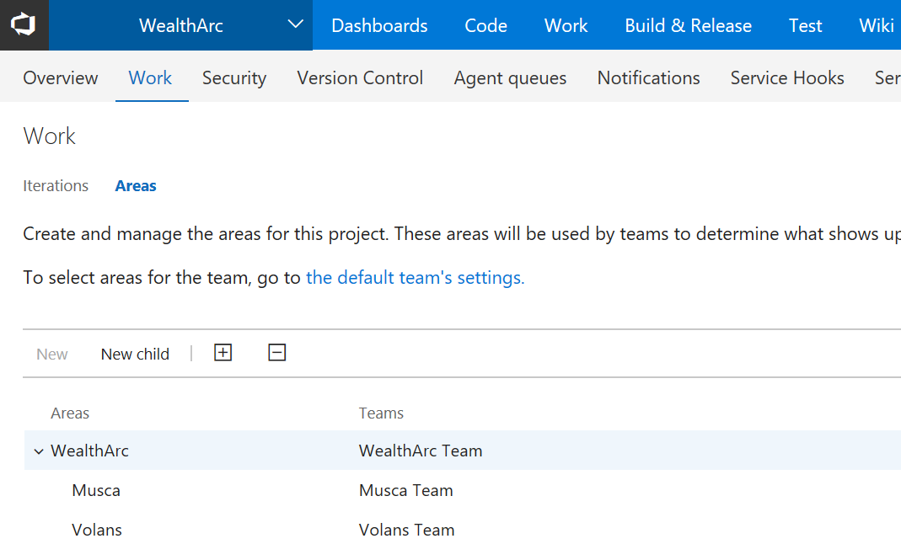
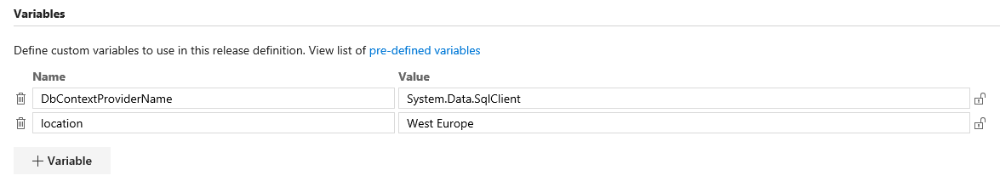

# WealthArc improves the efficiency and quality of its dev teams by adopting DevOps practices
>Author: [Dariusz Porowski](http://DariuszPorowski.MS/about/)
>Date: 2017-07-10

This article describes how Microsoft helped WealthArc increase the efficiency of its software development process with a primary focus on planning work, unifying tools and processes across teams, maintaining a high quality of code, and automating dev-test environments to the cloud.

## Key technologies used
* [Visual Studio Team Services](https://www.visualstudio.com/team-services) – share code, track work, and ship software for any language - all in a single package
* [Azure App Service](https://azure.microsoft.com/en-us/services/app-service) – cloud apps for web and mobile clients
* [Azure SQL Database](https://azure.microsoft.com/en-us/services/sql-database) – a managed cloud database
* [Azure Application Insights](https://azure.microsoft.com/en-us/services/application-insights) – insights through application performance management and instant analytics
* [Azure Resource Manager (ARM) templates](https://azure.microsoft.com/en-us/features/resource-manager) – cloud resources management

## Core team
* [Dariusz Porowski](http://DariuszPorowski.MS) – Senior Technical Evangelist, Microsoft
* Radomir Mastalerz – Chief Technology Officer, WealthArc
* Łukasz Chodarcewicz – Lead Software Architect, WealthArc
* Radosław Pawłowski – Software Developer, WealthArc
* Michał Kadłubowski – Software Developer, WealthArc

  

*Figure 1. Hackfest members*

## Customer profile
[WealthArc](http://wealtharc.com) is a cloud-based FinTech company, leveraging the latest technologies in big data and artificial intelligence (AI) for private banks and investment advisors. While maintaining the highest levels of cyber-security, WealthArc empowers investors and advisors to navigate the complex world of investment management. WealthArc brings private banking to affluent clients by using the cloud and artificial intelligence and harnessing robo-innovations.

Recently, WealthArc was nominated for the Top 5 FinTech Solutions in three categories by [WealthBriefing European Awards 2017](http://clearviewpublishing.com/events/wealthbriefing-european-awards-2017/) (Innovative FinTech Solution, Best Client Communication, Innovative Client Solution) for its consolidation and digital interaction solutions for HNWI and their financial advisors, and they won in two categories (Innovative FinTech Solution and Innovative Client Solution). Showcasing "best of breed" providers in the global private banking, wealth management, and trusted advisor communities, the awards were designed to recognize companies, teams, and individuals that the prestigious panel of judges deemed to have "demonstrated innovation and excellence during 2016."

In 2017, WealthArc is expanding its sales in the UK and Switzerland, as well as in other parts of Europe and the Middle East.

WealthArc supports management of over $10 billion in assets worldwide, with many references and revenue-generating clients in Switzerland, including Arfina Capital SA and EB Finanz.

## Problem statement
The WealthArc development department is split into two teams. Each team has independent responsibilities for one part of the platform, and each has a slightly different approach to work planning, use of multiple tools, manual steps, and source control. The software development process is not clear to team members, requires a lot of effort behind the scenes, and has several points of excessive activity. All these elements cause a very significant organizational overhead.

Moreover, each customer uses its own instance of the application (Web Apps in Azure App Service, Azure Storage, and Azure SQL Database). Application deployment for existing customers is done manually in each client environment. This process is becoming cumbersome as the number of clients increases. The implementation of the Azure infrastructure and application code for new customers is a manual process as well. 

In addition, there is no instant operation for creating dev-test environments.

## Solution, steps, and delivery
During the hackfests, Microsoft and WealthArc joined forces to try and solve these problems by doing the following:

* Discussing current architecture
* Creating a value stream mapping
* Customizing work management
* Developing a branch strategy and maintaining high quality of code
* Creating a build and release pipeline for the web application
* Delivering instant dev-test environments

### Discussing current architecture
We started with a discussion about current architecture. The WealthArc team tried to describe how their solution works, what components are used for the platform, and how everything is connected.

At a high level, the entire solution is split into two applications: a web application for end-user access, and a data processing and extract-transform-load (ETL) application.

Because there were two independent teams, this activity was very useful for getting each hackfest member on the same page, including WealthArc employees. 


*Figure 2. Discussion about architecture*

### Creating a value stream mapping

After the architecture knowledge transfer, we did a [value stream mapping](https://en.wikipedia.org/wiki/Value_stream_mapping) (VSM) exercise for the current development process.

The VSM opened the eyes of the WealthArc team and revealed that their processes were not clear and contained superfluous manual processes, unknown responsibilities, and task switching.

Based on the VSM exercise, we implemented the following DevOps practices:

* **Continuous integration (CI)** for automating the build and testing of code every time a team member commits changes to the repository.
* **Release management (RM)** for managing, planning, scheduling, and controlling a software delivery through different stages and environments.
* **Infrastructure as Code (IaC)** for managing infrastructure in a declarative model, using the same versioning system for source code that the development team uses.
* **Configuration management (CM)** for defining different configurations for each stage or environment, such as different connection strings to a SQL database for dev-test and production environments.
* **Continuous deployment (CD)** for building, configuring, and deploying from a build to a production environment.


*Figure 3. Value stream mapping*

### Customizing work management

WealthArc already had a work management tool based on Atlassian JIRA. After an introduction to Visual Studio Team Services work management, they decided to use it for future iterations. Because builds in a Scrum process do not meet WealthArc requirements, a new one was created based on the Agile template. Only a few fields on a few work item types were modified, such as adding more information about people.


*Figure 4. Customized User Story form - adding details about people*

WealthArc has two development teams that are responsible for an ETL application (code name Musca) and a web application (code name Volans). One of their requirements was to have different iterations for each team; that is, iterations for general and management purposes not directly related to software development. These goals were achieved by implementing three teams: one general (WealthArc), and two focused on development (Musca and Volans). Each development team also had their own area with dedicated iterations.


*Figure 5. Visual Studio Team Services project split between two development teams*



*Figure 6. Visual Studio Team Services project split between two areas*


*Figure 7. Iterations assigned to areas and teams in Visual Studio Team Services*

### Developing a branch strategy and maintaining high quality of code
This section describes how the code repository was adjusted to normalize everyday development and keep a high quality of code in the master branch.

#### Branch strategy
WealthArc was already using a Visual Studio Team Services private Git repository, but they had a very complex branch strategy that was not very clear for every developer. After quick brainstorming, we decided to keep the branch strategy as simple as possible and build a new plan based on these three concepts:

1. Use feature branches for all new features and bug fixes.
2. Merge feature branches into the master branch by using pull requests.
3. Keep a high quality, up-to-date master branch.

New structure for branches:

* **master** branch – merged code coming from different features, and bugfixes
* **bugfix** – a folder that has a branch for each bugfix that is not part of a stable release
* **feature** – a folder that has a branch for each product feature
* **hotfix** – a folder that has a branch for each hotfix that is part of a stable release
* **release** – a folder that has a branch for every stable product sent to QA

>If you are thinking about your Git branch strategy, you should keep it simple and read [Adopt a Git branching strategy](https://www.visualstudio.com/en-us/articles/git-branching-guidance).


*Figure 8. New branching strategy*


*Figure 9. Brainstorming*

#### Master branch policies
Several branch policies have been enabled on the master branch to protect branch quality. Each of the following policies must be finished successfully to allow merging of pull requests with the master branch.

* **Require a successful build**. This policy requires that changes in a pull request build successfully before the pull request can be completed.

     
     
     *Figure 10. Visual Studio Team Services branch policy - Require a successful build*

     This policy is associated with a build definition that checks that new code is building correctly. Unit tests are checking as well. Figure 11 shows a build definition for this policy. It is very simple with only four basic steps:

     * **Get sources**. Get sources from the Git repository.
     * **NuGet restore**. Install or restore missing NuGet packages.
     * **Build solution**. Build with MSBuild and set the Visual Studio version property.
     * **Test assemblies**. Run tests with Visual Studio test runner.
    
     

     *Figure 11. Visual Studio Team Services build definition for pull request*

* **Require linked work items**. Require associations between pull requests and a work item to ensure that changes to a branch have work item management tracking.

     

     *Figure 12. Visual Studio Team Services branch policy - Require linked work items*

* **Require code reviews**. Require teams to review their changes before completing a pull request. We agreed to set a minimum number of reviewers at 2, and a pull requestor cannot approve their own changes. Because two teams work on two different applications in the solution, we decided to create two groups for each team with senior developers as members; each reviewer group was associated with a review process for a dedicated path containing their project.

     

     *Figure 13. Visual Studio Team Services branch policy - Require code reviews*

* **All comments are resolved**. Check that all of the pull request comments are resolved. During code review, the reviewer can add some comments with notes, ideas, or issues for the developer. If any comment is not resolved, the pull request cannot be completed. 

     

     *Figure 14. Visual Studio Team Services branch policy - All comments are resolved*

* **Merge requirements**. Maintain a consistent branch history by enforcing a merge strategy when a pull request is completed. We agreed to squash changes when merging.

     

     *Figure 15. Visual Studio Team Services branch policy - Merge requirements*

### Creating a build and release pipeline for the web application
One of the most painful tasks for the WealthArc team was manually deploying to production and the dev-test environment. During the hackfest, we created a CI/CD pipeline for the web application focused on dev-test environments.

#### Continuous integration

The build pipeline for CI was not very fancy; most steps were based on an out-of-box configuration from a template for an ASP.NET application, but two important things were XDT Transform and filters on a trigger.

We used the [XDT Transform](https://marketplace.visualstudio.com/items?itemName=qetza.xdttransform) extension to inject tokens from XDT release configuration files for `Web.config` and `ApplicationInsights.config` to replace the local development setup, and to prepare artifacts to be ready to replace tokens during the release process with the right value for each environment.


*Figure 16. Visual Studio Team Services continuous integration - XDT Transform*

The Git repository keeps source code for both projects, but the build process should only be triggered when changes occur on the web application site (Volans project). To achieve this, we enabled path filters.


*Figure 17. Visual Studio Team Services continuous integration - Path Filters*

#### Continuous deployment

The release process is automatically triggered by a successful build creation (continuous deployment); it is split between four environments:

* **Dev** – dedicated for basic verification for the dev team
* **QA** – dedicated for testers to execute test plans
* **Staging** – staging slot waiting for a new release
* **Production** – production slot

**Variables**

A release definition uses several variables defined for all environments, and for each environment as well. A few dedicated variables per environment are used to replace tokens in config files; for example, connection strings to different databases.



*Figure 18. Visual Studio Team Services release management - Variables for entire definition*


*Figure 19. Visual Studio Team Services release management - Variables for dev environment*

**Dev, QA, staging environments**

Dev, QA, and staging environments are pretty much the same pipeline, as you can see in Figure 20. 


*Figure 20. Visual Studio Team Services release management - Dev environment pipeline*

Following are the steps used in the pipeline:

1. Create or update a resource group based on ARM templates (Infrastructure as Code).

      ```
        Title: Create or update Azure resources
        Task: Azure resource group deployment
        Action: Create or update resource group
        Resource group: $(resourceGroup)
        Location: $(location)
        Template location: Linked artifact
        Template: $(System.DefaultWorkingDirectory)/CI.Volans.master/drop/Volans.CloudInfra/volansWebApp.json
        Template parameters: $(System.DefaultWorkingDirectory)/CI.Volans.master/drop/Volans.CloudInfra/volansWebApp.parameters.json
        Override template parameters: -webAppName $(webAppName)
        Deployment mode: Incremental
      ```

2. Capture ARM outputs from ARM templates with Application Insights instrumentation key. This task is based on the [ARM Outputs](https://marketplace.visualstudio.com/items?itemName=keesschollaart.arm-outputs) extension.

      ```
        Title: Capture ARM Outputs: appInsightInstrumentationKey
        Task: ARM Outputs
        Resource Group: $(resourceGroup)
      ```

3. Replace tokens in `Web.config` and `ApplicationInsights.config` files that matched variables (include variables from ARM Output task). This task is based on the [Replace Tokens](https://marketplace.visualstudio.com/items?itemName=qetza.replacetokens) extension.

      ```
        Title: Replace tokens in *.config
        Task: Replace tokens
        Root directory: $(System.DefaultWorkingDirectory)/CI.Volans.master/drop/config
        Target files: *.config
        Files encoding: auto
        Token prefix: __
        Token suffix: __
      ```

4. Create a ZIP file with `Web.config` and `ApplicationInsights.config` files after tokens are replaced.

      ```
        Title: Archive config files
        Task: Archive files
        Root folder (or file) to archive: $(System.DefaultWorkingDirectory)/CI.Volans.master/drop/config
        Prefix root folder name to archive paths: false
        Archive type: zip
        Archive file to create: $(System.DefaultWorkingDirectory)/CI.Volans.master/drop/config.zip
        Replace existing archive: true
      ```

5. Deploy web application to Azure App Service by using Web Deploy.

      ```
        Title: Deploy web application to Azure App Service
        Task: Azure App Service deployment
        Package or folder: $(System.DefaultWorkingDirectory)/CI.Volans.master/drop/Volans.zip
        Publish using Web Deploy: true
      ```

6. Deploy config files to Azure App Service by using Web Deploy.

      ```
        Title: Deploy config files to Azure App Service
        Task: Azure App Service deployment
        Package or folder: $(System.DefaultWorkingDirectory)/CI.Volans.master/drop/config.zip
        Publish using Web Deploy: true
      ```

7. Reload Azure App Service after the entire deployment.

      ```
        Title: Restart Azure App Service
        Task: Azure App Service manage
        Action: Restart App Service
        App Service name: $(webAppName)
      ```

**Infrastructure as Code**

Azure resources for the web application (including Application Insights) are delivered by ARM templates. You can find a full ARM template on the [GitHub repository volantWebApp.json](https://github.com/DariuszPorowski/TechCaseStudies/blob/master/WealthArc/volantWebApp.json). You can find the parameters file for this template on the [GitHub repository volantWebApp.parameters.json](https://github.com/DariuszPorowski/TechCaseStudies/blob/master/WealthArc/volantWebApp.parameters.json).

### Delivering instant dev-test environments

The most painful problem for WealthArc was creating dev-test environments for developers. Everything was set up manually and took a lot of time. One of the main requirements was to clone a "gold" database with example data. To accelerate this, we created ARM templates for an ad-hoc execution that delivered an entire dev-test environment, including a database clone and connection string generation for the web application.

#### IaC for dev-test

Following is the most interesting part of the database clone process that used the ARM templates. The `createMode` parameter is set to `Copy` by using a variable.

*adhocDevTest.json*

```json
        {
          "apiVersion": "2014-04-01",
          "name": "[concat(parameters('sqlServerName'), '/', parameters('databaseName'))]",
          "location": "[resourceGroup().location]",
          "properties": {
            "createMode": "[variables('databaseCreateMode')]",
            "sourceDatabaseId": "[variables('sourceDatabaseId')]",
            "requestedServiceObjectiveName": "[parameters('databaseRequestedServiceObjectiveName')]"
          },
          "dependsOn": [
            "[concat('Microsoft.Sql/servers/', parameters('sqlServerName'))]"
          ],
          "type": "Microsoft.Sql/servers/databases"
        }
```

You can find the full ARM template on the [GitHub repository adhocDevTest.json](https://github.com/DariuszPorowski/TechCaseStudies/blob/master/WealthArc/adhocDevTest.json).

## Conclusion and future directions
The results of the hackfest were satisfying for WealthArc. We put together their process and raised awareness of DevOps.

We gave WealthArc some recommendations and ideas to consider for the future:
* Keep one code for the web application based on the multi-tenant approach and feature flags.
* Use Azure Key Vault for improving overall security.
* Focus more on automating tests such as unit tests and selenium tests.
* Design CI/CD for the second part of the solution, the ETL application.
* Design release management for ad-hoc dev-test environment delivery based on existing ARM template.

Following are a few interesting facts and improvements after the hackfest:
* We reduced the time for ad-hoc dev-test environment delivery (manual work + wait time) from about 6 hours to 15 minutes (automatic process on request).
* We automated the process for new pull request validation, which reduced the overall time (manual work + wait time) from about 2-4 hours to 15 minutes.
* We eliminated the "ups factor" from the development process by tokenizing XML files. Now developers are not responsible for configuration setup during dev-test deployment. It reduced the management effort and preparation time from about 30 minutes to zero.

### WealthArc testimonial about project
> "Dariusz is the true-born evangelist! During the hackfest we have significantly improved our development process and received constructive advice on future enhancements. Microsoft proved it not only provides a fantastic cloud platform but is also eager to share knowledge and educate Azure customers."
> 
> —Radomir Mastalerz, CTO, WealthArc

## Additional resources

For more information about DevOps, see:
* [Guide through the theory and implementation of DevOps](https://www.visualstudio.com/devops)
* [DevOps at Microsoft](https://www.visualstudio.com/en-us/articles/devopsmsft/overview)
* [Microsoft - Our DevOps Journey](http://stories.visualstudio.com/devops)

A good starting point for more information about the technologies we used:
* [Visual Studio Team Services documentation](https://www.visualstudio.com/en-us/docs/overview)
* [Azure App Service documentation](https://docs.microsoft.com/en-us/azure/app-service)
* [Azure SQL Database documentation](https://docs.microsoft.com/en-us/azure/sql-database)
* [Azure Application Insights documentation](https://docs.microsoft.com/en-us/azure/application-insights)
* [Azure Resource Manager documentation](https://docs.microsoft.com/en-us/azure/azure-resource-manager)