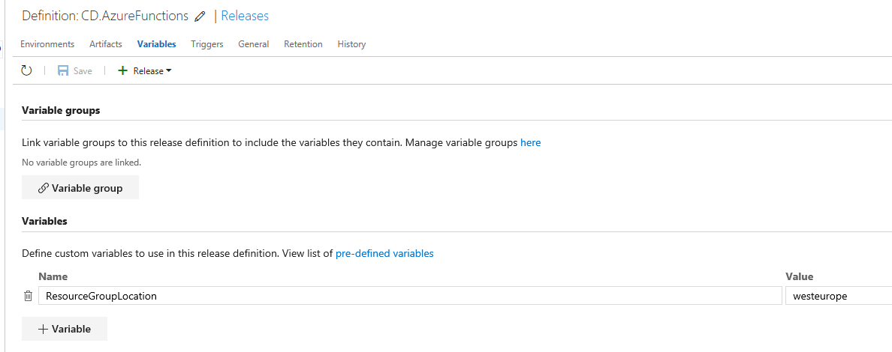
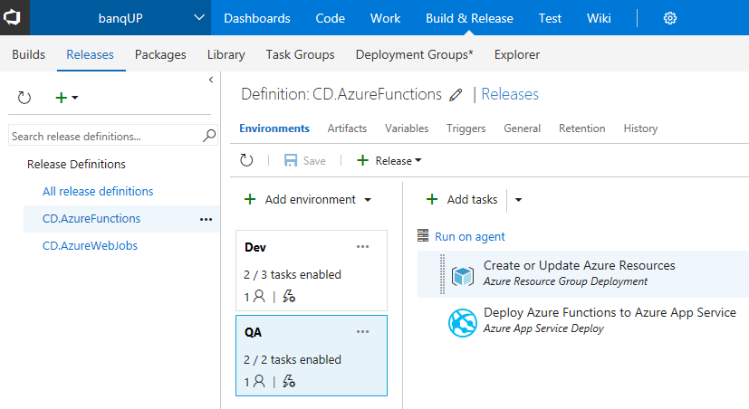

# With Azure, banqUP is on its way to building a banking platform in the cloud
> Authors: [Dariusz Porowski](http://DariuszPorowski.MS), [Tomasz Wisniewski](https://www.linkedin.com/in/wisniewskitomasz/)
>
> Date: 2017-05-22

Microsoft and banqUP worked together to design and implement a platform to help build a digital bank from scratch as well as to help existing banks innovate faster in selected verticals. 

banqUP is a use case for building a small and medium-sized enterprise (SME) bank that is vertical/industry-wise. This is our use case for the platform.

## Table of Contents
* [Key technologies used](#key-technologies-used)
* [Core team](#core-team)
* [Customer profile](#customer-profile)
* [Problem statement](#problem-statement)
* [Solution, steps, and delivery](#solution-steps-and-delivery)
	* [Architecture](#architecture)
	* [Value Stream Mapping](#value-stream-mapping)
	* [Build and release pipeline for Azure Functions](#build-and-release-pipeline-for-azure-functions)
* [Conclusion and future directions](#conclusion-and-future-directions)
	* [Facts and improvements](#facts-and-improvements)
	* [banqUP - in their own words](#banqup---in-their-own-words)
* [Additional resources](#additional-resources)

## Key technologies used
* [Visual Studio Team Services](https://www.visualstudio.com/team-services) - Share code, track work, and ship software for any language, all in a single package.
* [Azure App Service](https://azure.microsoft.com/en-us/services/app-service) - Cloud apps for web front end and Web Jobs as connectors and batch jobs.
* [Azure Functions](https://docs.microsoft.com/en-us/azure/azure-functions/) - Connectors and web hooks for connecting with external services.
* [Azure Application Insights](https://azure.microsoft.com/en-us/services/application-insights) - Insights through application performance management and instant analytics.
* [Azure Resource Manager templates](https://azure.microsoft.com/en-us/features/resource-manager) - Cloud resource management.
* [Azure SQL Database](https://docs.microsoft.com/en-us/azure/sql-database/) - Storing relational information.
* [Azure Notification Hubs](https://docs.microsoft.com/en-us/azure/notification-hubs/) - Sending text messages (SMS), emails, and push notifications.
* [Azure Redis Cache](https://docs.microsoft.com/en-us/azure/redis-cache/) - Storing cache information and non-relational data.
* [Azure Service Bus](https://docs.microsoft.com/en-us/azure/service-bus/) - Central point of system that communicates all the components in a manageable and safe way for exchanging messages.

## Core team
* [Tomasz Wiśniewski](http://azure.tomaszwisniewski.com) – Technical Evangelist, Microsoft
* [Dariusz Porowski](http://DariuszPorowski.MS) – Senior Technical Evangelist, Microsoft
* Krzysztof Pulkiewicz – Chief Executive Officer, banqUP
* Anna Ciesielska – Board Member, banqUP
* Łukasz Chmielewski – Chief Technology Officer, banqUP
* Natalia Zienkowicz – Project Manager, banqUP
* Bartłomiej Zalewski – Software Developer, banqUP

  

*Figure 1. Hackfest members*

## Customer profile
Headquartered in Belgium, [banqUP.com](https://app.banqup.com) is a digital-first financial technology (FinTech) bank focused on small and medium-sized enterprises (SMEs). It provides a one-stop-shop combination of core banking products (business accounts, MasterCard) and integrated FinTech services.

 

It has an international team composed of seasoned consultants and entrepreneurs with experience in digital banking, FinTech, and IT architecture. Its mission is to reshape the SME banking landscape and financial services across Europe.

## Problem statement
The banqUP team had various issues they wanted to address with Azure and other technologies:
* Improve their development process by automating the build and release processes and centralize it in one location rather than being done by individual developers from their workstations.
* Use the Web Apps feature of Azure App Service for the front end, which provides scalability, security, and deployment options in different data centers.
* Give the application multiple connectors for multiple services and additional features, which is ideal for Azure Functions or WebJobs - depending on the connector requirements, one or the other can be used.

## Solution, steps, and delivery
The steps we took to deliver the solution directly correspond to the issues described above. They are as follows:
* Architecture
* Value stream mapping
* Build and release pipeline for Azure Functions
* Use of Web Apps for the front end (not described in this write-up)
* Application monitoring with Application Insights

### Architecture
We started with a discussion of the current architecture. The banqUP team described how their solution works, what components are used for the platform, and how everything is connected.


*Figure 2. Architecture*

This activity was useful for getting each hackfest participant on the same page, including those from the banqUP team.

### Value Stream Mapping
After the architecture knowledge transfer, we conducted a [value stream mapping](https://en.wikipedia.org/wiki/Value_stream_mapping) (VSM) exercise for the current development and delivery process.


*Figure 3. Value stream mapping*

The development process for banqUP does not exist in any defined way, so the VSM exercise was challenging. From the exercise, we found a couple of waste points and decided to focus on one of the most painful issues for the banqUP team: continuous integration/continuous deployment for Azure Functions. To summarize, we decided to implement some DevOps practices:
* **Infrastructure as Code (IaC)** for infrastructure management in a declarative model, using the same versioning control system as the development team uses for source code.
* **Continuous Integration (CI)** for automating the build and testing of code every time a team member commits changes to the repository.
* **Continuous Deployment (CD)** to build, configure, and deploy to different environments.

### Build and release pipeline for Azure Functions
The banqUP team develops Azure Functions directly on each environment through a web browser using App Service Editor, without storing code in a repository. After developing a function in a dev environment, a developer copy/pastes new code to the second environment. To avoid scenarios with manual tasks and unmanaged processes, we prepared the whole end-to-end solution using several DevOps practices such as continuous integration, continuous deployment, and infrastructure as code.

#### Continuous Integration
A build pipeline for CI was not very difficult. The steps and details are shown below.


*Figure 4. Visual Studio Team Services build - tasks*

1. Get sources from Git repository.
    
    ```
    Task: Get sources
    Title: Get sources
    Repository: banqUP
    Branch: master
    ```

2. Copy all .json Resource Manager templates.
    
    ```
    Task: Copy Files
    Display name: Prepare ARM Templates
    Source Folder: AzureFunctions/AzureResourceGroup1/Templates
    Contents: *.json
    Target Folder: $(Build.ArtifactStagingDirectory)\Templates
    ```
    
3. Copy all scripts.
    
    ```
    Task: Copy Files
    Display name: Prepare Scripts
    Source Folder: AzureFunctions/AzureResourceGroup1/Scripts
    Contents: **
    Target Folder: $(Build.ArtifactStagingDirectory)\Scripts
    ```
    
4. Copy all Azure Functions files (excluding project files such as .locak.json, appsettings.json, and .funproj).
    
    ```
    Task: Copy Files
    Display name: Prepare temporary folder with Azure Functions
    Source Folder: AzureFunctions/FunctionApp1
    Contents: **\!(*.locak.json|appsettings.json|*.funproj)
    Target Folder: $(System.DefaultWorkingDirectory)\Functions-Temp
    ```
    
5. Create ZIP archive with Azure Functions application.
    
    ```
    Task: Archive Files
    Display name: Archive Azure Functions from temporary folder
    Archive Azure Function from temporary folder: $(System.DefaultWorkingDirectory)\Functions-Temp
    Prefix root folder name to archive paths: false
    Archive type: zip
    Archive file to create: $(Build.ArtifactStagingDirectory)\AzureFunctions.zip
    ```
    
6. Publish build artifacts.
    
    ```
    Task: Publish Build Artifacts
    Display name: Publish Artifact: drop
    Publish Build Artifacts: $(Build.ArtifactStagingDirectory)
    Artifact Name: drop
    Artifact Type: Server
    ```
    
The Git repository keeps source code for Azure functions and other applications. In this case, the build process should be triggered only when changes are made in any Azure function. To achieve this, we enabled path filters. All Azure functions are placed in an AzureFunctions folder.


*Figure 5. Visual Studio Team Services continuous integration - path filters*

#### Continuous Deployment
The release process is automatically triggered by successful build creation (continuous deployment), and it is split between two environments. In this case, the banqUP team wants only CI/CD for these environments because production has not been released yet.
1. **Dev** - dedicated for basic verification for the dev team.
2. **QA** - dedicated for testers to execute test plans.

#### Application Monitoring
One of the most important aspects of a full DevOps cycle and deployment to any environment - Azure included - is monitoring the application in production.

At the start, banqUP was using a third-party monitoring tool for the web app and the integrated monitoring for Azure Functions. There were two basic issues with this:
* Two tools needed to be used while monitoring.
* The integrated monitoring feature of Azure Functions did not monitor everything that was needed.

Application Insights allowed monitoring of both the web app and Azure Functions and was very easy to set up.

To add Application Insights to a web application, open the solution in Visual Studio, right-click on the project, select **Configure Application Insights...** and follow the wizard.


*Figure 6. Visual Studio - configure Application Insights*

Adding Application Insights to Azure Functions is currently more complex and is not a fully production-ready solution, but it has so many benefits that they overcome the issues that may sometimes occur.

To add monitoring to Azure Functions:

1. Create a new AppI instance.
2. Get the instrumentation key from the Azure Portal Application Insights blade.
    
    

    *Figure 7. Visual Studio - Application Insights instrumentation key*
      
3. Add a new setting to the Azure function in the format:
    
    ```
    APPINSIGHTS_INSTRUMENTATIONKEY = {Instrumentation Key}
    ```
    
##### Variables
A release definition uses several variables defined for all environments, and for each environment as well.



*Figure 8. Visual Studio Team Services release management - variables for the whole definition*


*Figure 9. Visual Studio Team Services release management - variables for dev environment*

Variables for the QA environment are pretty much the same. The changes are only in values.

##### Dev and QA environments
The dev and QA environments have the same pipeline. Below are the steps used in the pipeline.



*Figure 10. Visual Studio Team Services release management - dev and QA environment pipeline*

1. Create or update resource group based on Resource Manager templates (infrastructure as code).
    
    ```
   Task: Azure Resource Group Deployemnt
   Title: Create or Update Azure Resources
   Action: Create or update resource group
   Resource group: $(ResourceGroupName)
   Location: $(ResourceGroupLocation)
   Template location: Linked artifact
   Template: $(System.DefaultWorkingDirectory)/CI.AzureFunctions/drop/Templates/banqupAzureFunctions.json
   Template parameters: $(System.DefaultWorkingDirectory)/CI.AzureFunctions/drop/Templates/banqupAzureFunctions.parameters.json
   Override template parameters: -functionAppName $(AppServiceName)
   Deployment mode: Incremental
   ```
    
2. Deploy Azure Functions through Web Deploy.
    
   ```
   Task: Azure App Service Deployment
   Title: Deploy Azure Functions to Azure App Service
   App Service name: $(AppServiceName)
   Package or Folder: $(System.DefaultWorkingDirectory)/CI.AzureFunctions/drop/AzureFunctions.zip
   Publish using Web Deploy: true
   Remove additional files at destination: true
   ```

#### Infrastructure as Code
To avoid manual Azure resources creation for environments, we developed a Resource Manager template for Azure Functions to keep consistency between environments and developers. Because Azure Functions is based on Azure App Service, the Resource Manager template is very similar to a standard Azure web app resource. Only a couple of things need to be changed - for example, the **kind** parameter is **functionapp**, and the properties in the **appsettings** section.

```json
{
    "apiVersion":"2016-08-01",
    "type":"Microsoft.Web/sites",
    "name":"[variables('functionAppName')]",
    "location":"[resourceGroup().location]",
    "kind":"functionapp",
    "properties":{
    "name":"[variables('functionAppName')]",
    "serverFarmId":"[resourceId('Microsoft.Web/serverfarms', variables('hostingPlanName'))]",
    "clientAffinityEnabled":false
    },
    "resources":[
    {
        "apiVersion":"2016-03-01",
        "name":"appsettings",
        "type":"config",
        "dependsOn":[
            "[resourceId('Microsoft.Web/sites', variables('functionAppName'))]"
        ],
        "properties":{
            "AzureWebJobsStorage":"[concat('DefaultEndpointsProtocol=https;AccountName=',variables('storageAccountName'),';AccountKey=',listkeys(resourceId('Microsoft.Storage/storageAccounts', variables('storageAccountName')), '2016-12-01').keys[0].value,';')]",
            "AzureWebJobsDashboard":"[concat('DefaultEndpointsProtocol=https;AccountName=',variables('storageAccountName'),';AccountKey=',listkeys(resourceId('Microsoft.Storage/storageAccounts', variables('storageAccountName')), '2016-12-01').keys[0].value,';')]",
            "FUNCTIONS_EXTENSION_VERSION":"latest",
            "WEBSITE_CONTENTAZUREFILECONNECTIONSTRING":"[concat('DefaultEndpointsProtocol=https;AccountName=',variables('storageAccountName'),';AccountKey=',listkeys(resourceId('Microsoft.Storage/storageAccounts', variables('storageAccountName')), '2016-12-01').keys[0].value,';')]",
            "WEBSITE_CONTENTSHARE":"[concat(variables('functionAppName'), 'share')]"
        }
    }
    ],
    "dependsOn":[
    "[resourceId('Microsoft.Web/serverfarms', variables('hostingPlanName'))]",
    "[resourceId('Microsoft.Storage/storageAccounts', variables('storageAccountName'))]"
    ]
}
```

You can find the full Resource Manager template on the GitHub repository: [banqupAzureFunctions.json](src/banqupAzureFunctions.json)
 
## Conclusion and future directions
At this time, banqUP is focusing on bringing the application to a production-ready state with all the necessary features up and working, keeping all of the architecture, DevOps practices, and technologies such as Azure Functions in the center.

For the future, banqUP plans to develop a mobile application and incorporate artificial intelligence into its system for predictive analysis, conversation as a platform, and big data.

### Facts and improvements
A few interesting facts and enhancements following the hackfest:
* We designed a fundamental development process from scratch, so now team members know what they are responsible for and what the steps are from beginning to end. This eliminated task switching and improved overall performance.
* We improved the deployment process for Azure App Service, which now allows the developers to deploy and test their solution in a much more manageable and predictable way.
* We automated the process for validation of new pull requests, reducing the overall time (manual work plus wait time) from about 4-8 hours to 15-30 minutes. 
* We improved the monitoring solution by moving from built-in Azure Functions monitoring to Application Insights, which gives the developers a much more comprehensive overview of the application condition.

### banqUP - in their own words
> "We have decided to build our platform on the Microsoft Azure cloud to leverage a rich set of services and provide scalability and security. For us, the hackfest was an excellent opportunity to review the architecture and check if we are using those services in the most efficient way, as well as to help us design the technical roadmap for the dynamic development of banqUP."
> 
> — Krzysztof Pulkiewicz, CEO, banqUP

> "The project was a very useful experience. It not only allowed us to get to know the Microsoft Azure environment much better but also improved our DevOps process a lot and put it on the right track. Having Microsoft specialists answering all the questions of our dev team and working closely with us solved many problems we encountered on our way to building a modern banking platform in the Microsoft cloud."
> 
> — Łukasz Chmielewski, CTO, banqUP

## Additional resources
For more information on DevOps, see:
* [Your guide through the theory and implementation of DevOps](https://www.visualstudio.com/devops)
* [DevOps at Microsoft](https://www.visualstudio.com/en-us/articles/devopsmsft/overview)
* [Microsoft - Our DevOps Journey](http://stories.visualstudio.com/devops)

For more information on the technologies we used, the following are good starting points:
* [Visual Studio Team Services documentation](https://www.visualstudio.com/en-us/docs/overview)
* [Azure App Service documentation](https://docs.microsoft.com/en-us/azure/app-service)
* [Azure Application Insights documentation](https://docs.microsoft.com/en-us/azure/application-insights)
* [Azure Resource Manager documentation](https://docs.microsoft.com/en-us/azure/azure-resource-manager)
